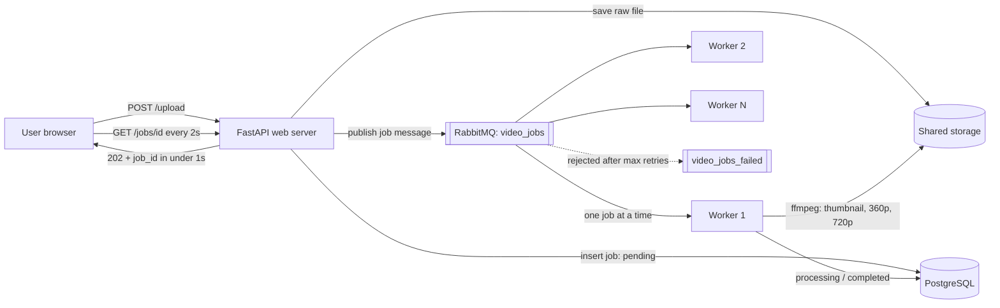
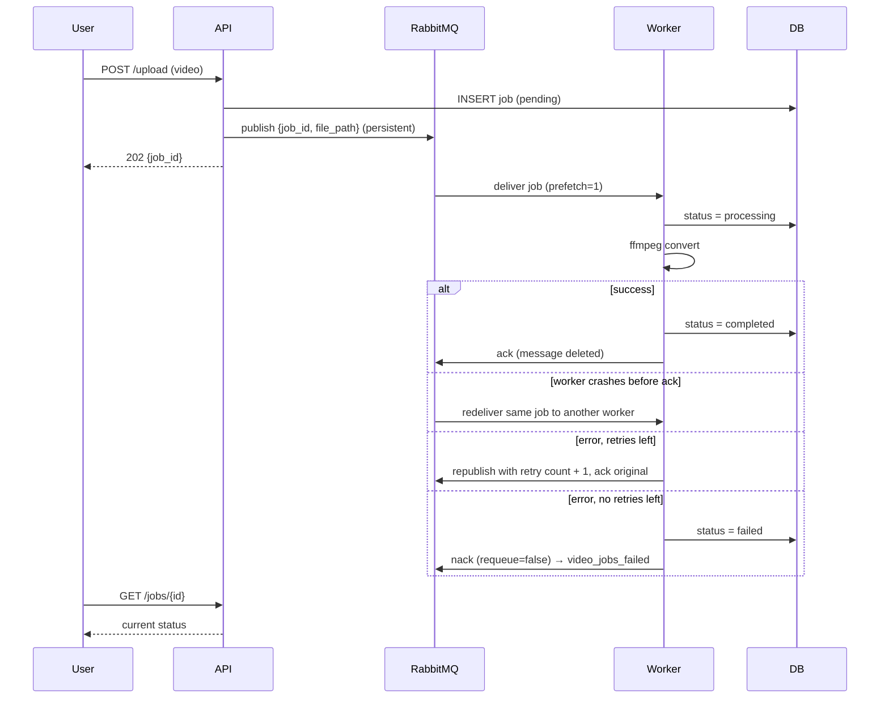

# Media Upload Queue Demo (RabbitMQ)

Project 02 by <Your Name> (<Student ID>).

A media sharing site used to convert videos while the user waited (3 to 8 minutes). This demo separates
**receiving** a file from **processing** it: the API saves the file, creates a `pending` job, puts a message
on a RabbitMQ queue and replies instantly. Background workers convert the video and update the status.

## Run it

Requirements: Docker Desktop (includes Docker Compose).

```bash
git clone <your-repo-url>
cd media-queue-demo
docker compose up --build
```

| What | URL |
|---|---|
| Upload page and job table | http://localhost:8000 |
| API docs (Swagger) | http://localhost:8000/docs |
| RabbitMQ dashboard (guest / guest) | http://localhost:15672 |

## Architecture



## Job lifecycle



## How the proposal's promises map to code

| Promise | Implementation |
|---|---|
| Instant reply | `api/main.py` `upload()` saves, inserts, publishes, returns. No conversion. |
| Jobs survive a restart | Queue `durable=True`, messages `delivery_mode=2`, RabbitMQ data on a volume |
| Crashed worker's job is retried | `auto_ack=False`; `basic_ack` only after success |
| One job per worker | `basic_qos(prefetch_count=1)` |
| Failure queue | `x-dead-letter-exchange: dlx` + `basic_nack(requeue=False)` after `MAX_RETRIES` |
| Scale without touching the website | `docker compose up -d --scale worker=3` |

## Demo scenarios

See [`docs/STEP_BY_STEP_GUIDE.md`](docs/STEP_BY_STEP_GUIDE.md), Phase 4.

## Reset everything

```bash
docker compose down -v
```
