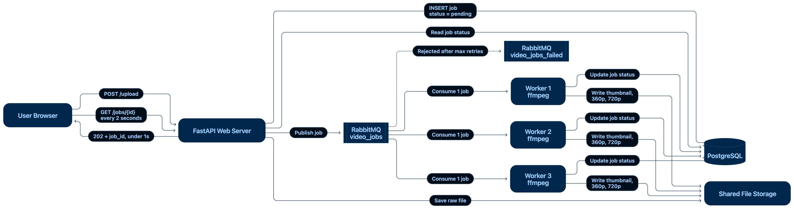

# Media Upload Queue Demo (RabbitMQ)

Team:\
Aung Myint Myat\
Soe Min Min Latt\
Min Thant

A media sharing site used to convert videos while the user waited (3 to 8 minutes). This demo separates **receiving** a file from **processing** it: the API saves the file, creates a `pending` job, puts a message on a RabbitMQ queue and replies in under 100 ms. Background workers convert the video and update the status.

---

## The problem

When a user pressed Upload, the website did everything in one request: receive the file, create 360p / 720p / 1080p versions, generate a thumbnail, save everything, and only then reply.

| Symptom | Cause |
|---|---|
| User stares at a loading screen for 3 to 8 minutes | Conversion runs inside the request |
| Upload lost when the user closes the tab | No record of the work exists until it finishes |
| Timeout errors on files that uploaded fine | Request outlives the connection limit |
| Whole site slows down during busy periods | Video encoding eats the web server's CPU |
| A crashed converter loses the job forever | No retry, no record, no queue |

The root cause: a slow, heavy task was being done while the user waited for an answer.

---

## The solution

Upload and processing are separated. The API stores the raw file, records a job, publishes a message and replies immediately. Workers consume from the queue and convert in the background, moving the job through `pending` → `processing` → `completed`. The user can poll the status at any time, like tracking a delivery.

**Technology of interest: RabbitMQ**, a message broker that acts as the waiting line between the website and the workers.

| Why RabbitMQ | How |
|---|---|
| Nothing is lost on restart | Durable queues + persistent messages, written to disk |
| A crashed worker's job is retried | Messages are deleted only after the worker acknowledges success |
| Bad jobs don't block the line | Dead-letter queue after a set number of retries |
| Handles busy periods | Add more workers without touching the website |

---

## Architecture

<!-- Replace with your image:  -->

**Components**

| Service | Role |
|---|---|
| `api` (FastAPI) | Saves the file, records the job, publishes the message, replies. Never converts video. |
| `rabbitmq` | The waiting line. Queue `video_jobs`, failure queue `video_jobs_failed`. |
| `worker` (Python + ffmpeg) | Takes one job at a time, converts, updates status, acknowledges. Scalable. |
| `postgres` | Stores job records and their status. |

---

## Job lifecycle

<!-- Replace with your image:  -->

**Statuses:** `pending` → `processing` → `completed`
On error: `processing` → `retrying` (up to 3 times) → `failed`, and the message moves to `video_jobs_failed`.

---

## Running it

**Requirements:** Docker Desktop (includes Docker Compose).

```bash
git clone https://github.com/Tawan0224/media-queue-demo.git
cd media-queue-demo
docker compose up --build
```

The first build takes a few minutes. It is ready when the logs show `waiting for jobs`.

| What | URL |
|---|---|
| Upload page and job table | http://localhost:8000 |
| API documentation (Swagger) | http://localhost:8000/docs |
| RabbitMQ dashboard (`guest` / `guest`) | http://localhost:15672 |

Generate a test video if you don't have one:

```bash
docker compose exec worker ffmpeg -y -f lavfi -i testsrc=duration=20:size=1920x1080:rate=30 -f lavfi -i sine=frequency=440:duration=20 -shortest /data/sample.mp4
docker compose cp worker:/data/sample.mp4 ./sample.mp4
```

Stop everything with `docker compose down`, or `docker compose down -v` to also erase all data.

---
## Architecture


## API

| Method | Endpoint | Purpose |
|---|---|---|
| `POST` | `/upload` | Saves the file, queues the job, returns `{job_id, status}` (HTTP 202) |
| `GET` | `/jobs/{job_id}` | Status of one job |
| `GET` | `/jobs` | 20 most recent jobs |

```bash
curl -F "file=@sample.mp4" http://localhost:8000/upload
curl http://localhost:8000/jobs/<job_id>
```

---

## How each promise maps to code

| Promise | Implementation |
|---|---|
| Instant reply | `api/main.py` → `upload()` saves, inserts, publishes, returns. No conversion. |
| Jobs survive a restart | `durable=True` queue, `delivery_mode=2` messages, RabbitMQ data on a volume |
| A crashed worker's job is retried | `auto_ack=False`; `basic_ack` runs only after success |
| One job per worker | `basic_qos(prefetch_count=1)` |
| Failure queue | `x-dead-letter-exchange: dlx` + `basic_nack(requeue=False)` after `MAX_RETRIES` |
| Scale without touching the website | `docker compose up -d --scale worker=3` |

---

## Tested scenarios

| # | Scenario | Result |
|---|---|---|
| 1 | Normal upload | Server replies in ~90 ms; conversion finishes in the background |
| 2 | Status tracking | `pending` → `processing` → `completed`, visible in the table |
| 3 | Worker killed mid-job | Another worker receives it with `redelivered=True` and completes it |
| 4 | Corrupted file | Retried 3 times, marked `failed`, moved to `video_jobs_failed` |
| 5 | RabbitMQ restart / scaling | Queued messages survive; 3 workers drain the queue in parallel |

<!-- Optional: add screenshots here, e.g.  -->

---

## Project structure

```
media-queue-demo/
├── docker-compose.yml     rabbitmq, postgres, api, worker
├── api/
│   ├── main.py            upload, job status, list jobs
│   ├── static/index.html  upload page with auto-refreshing job table
│   ├── requirements.txt
│   └── Dockerfile
├── worker/
│   ├── worker.py          consumes jobs, runs ffmpeg, retries, dead-letters
│   ├── requirements.txt
│   └── Dockerfile         installs ffmpeg
└── docs/                  diagrams and screenshots
```

---

## Configuration

Set in `docker-compose.yml` under the `worker` service:

| Variable | Default | Meaning |
|---|---|---|
| `MAX_RETRIES` | `3` | Attempts before a job goes to the failure queue |
| `SLOW_MODE_SECONDS` | `15` | Artificial delay so status changes are visible during a demo. Set to `0` to disable. |

---

## Possible improvements

- Add a 1080p rendition
- Replace status polling with Server-Sent Events or WebSockets
- Store media in S3 or MinIO instead of a shared volume
- Notify the user by email or push when a job completes
- Autoscale workers based on queue depth
